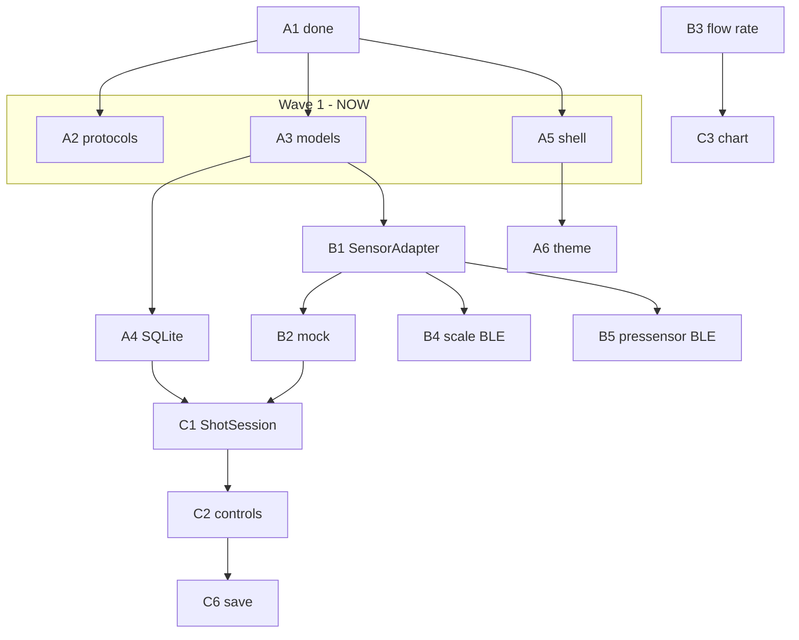

# Parallel agent waves

Pick **one slice per agent**. Only start a slice when **all prerequisites** are `done` in `docs/slices/`.

Check status: `grep -l '^status: done' docs/slices/*.md | wc -l`

## Current state

**Done:** A1

**Spawn now (Wave 1 — up to 3 agents):**

| Agent | Slice | Touches | Won't conflict with |
|-------|-------|---------|---------------------|
| 1 | **A2** | `docs/protocols/` only | A3, A5 |
| 2 | **A3** | `packages/flowlog_core/lib/src/models/` | A2, A5 |
| 3 | **A5** | `app/flowlog/lib/shell/`, `screens/` | A2, A3 |

## Wave reference

Each wave lists slices that can run **at the same time** (disjoint files).

### Wave 1 — after A1

`A2` · `A3` · `A5`

### Wave 2 — after A3

`A4` · (continue A5 if not done) · `A6` after A5

### Wave 3 — after A4 + A5 + A6 + A3

`B1`

### Wave 4 — after B1

`B2` · `B3` · `B4` · `B5` — **4 agents possible**

### Wave 5 — after B4 + B5

`B6` · `B7` (needs A5) · continue `B2`→`B3` chain

### Wave 6 — after A4 + B2 + B3

`C1` · `C3` · `B7` — **3 agents**

### Wave 7 — after C1

`C2` · `C4` · `C5` · `C7` — **4 agents** (C5 only needs A3)

### Wave 8 — after C2 + C5

`C6`

### Wave 9 — after C6

`C8` · `D1` · `D3` — **3 agents**

### Wave 10 — after D1 + C3

`D2` · `D4` · `F4`

### Wave 11 — after D3

`D5` · `F1` · `F2`

### Wave 12 — polish (post-MVP)

`E1`–`E7` mostly parallel once C3/C4/C6 exist; check `parallel_with` in each slice file.

### Wave 13 — library

`F3`–`F7` after D/F prerequisites.

### Wave 14 — future

`G1`–`G6` independent modules; never block MVP.

## Dependency diagram



## Agent spawn cheat sheet

Tell each agent:

```
Read docs/AGENT_GUIDE.md and docs/slices/SLICE-XX.md.
Implement only that slice. Run Verify. Set status: done.
Do not edit files outside Scope.
```

**Conflict avoidance:** If two slices list the same path in Scope, don't run them together. `parallel_with` in each slice file is the hint.

## Suggested multi-agent session (today)

```text
Agent Alpha → start A2
Agent Beta  → start A3
Agent Gamma → start A5
```

When all three finish → run `melos run test` once at the root, then spawn Wave 2 (`A4` + `A6`).